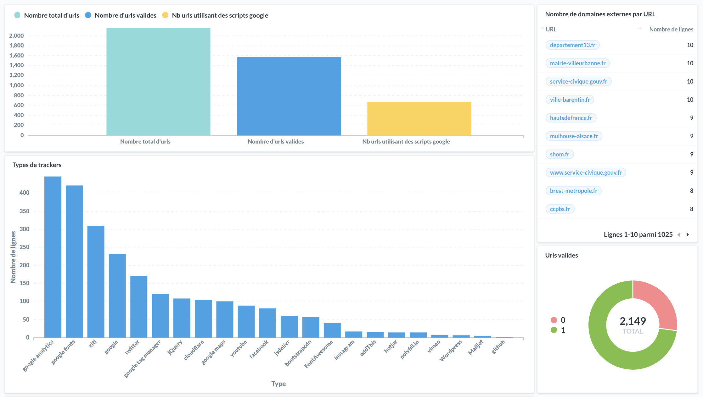

# 🕵🏻‍♂️ trackscan

Analyse des trackers présents sur la page d'accueil des [sites des organismes publics 🇫🇷](https://github.com/etalab/noms-de-domaine-organismes-publics)



## Update 2021

Ce projet a évolué vers de nouveaux outils : 

 - [DashLord](https://github.com/SocialGouv/dashlord) : tableau de bord des trackers, cookies et bonnes pratiques techniques
 - [thirdparties](https://github.com/SocialGouv/thirdparties): liste des trackers et remédiations

## How it works

Ce script ouvre des pages web et vérifie les requêtes vers des domaines externes avec [puppeteer](https://github.com/puppeteer/puppeteer).

Les données sont exportées vers une base SQLite pour analyse avec [SQLiteStudio](https://sqlitestudio.pl/), [Metabase](https://metabase.com/) ou autre.

La base SQLite générée est dispo ici : [./db.sqlite](./db.sqlite)

Un dump CSV est également dispo : [./dump.csv](./dump.csv)

Pour lancer un nouveau scan : `yarn scan`

## exploitation avec Metabase

Placez la base SQLite dans `/tmp` puis lancez metabase :

```sh
docker run --rm -d -p 3010:3000 -v /tmp:/tmp -e "MB_DB_FILE=/tmp/metabase.db" metabase/metabase
```

Ouvrez http://127.0.0.1:3010 , importez votre fichier SQLite (il doit être présent dans un volume du container) puis explorez les données.

## trackers

| id                       |
| ------------------------ |
| 6tzen                    |
| FontAwesome              |
| Mailjet                  |
| Wordpress                |
| addThis                  |
| amplitude.com            |
| apple                    |
| batch push notifications |
| bootstrapcdn             |
| cloudflare               |
| facebook                 |
| faktor.io                |
| github                   |
| google                   |
| google analytics         |
| google fonts             |
| google maps              |
| google tag manager       |
| hotjar                   |
| instagram                |
| jQuery                   |
| jsdelivr                 |
| polyfill.io              |
| twitter                  |
| vimeo                    |
| xiti                     |
| youtube                  |

voir [./src/trackers.js](./src/trackers.js)

## Todo

- count total request and payload size
- use some standard tracker database
- detect RGPD warnings
- make suggestions for alternatives/fixes
